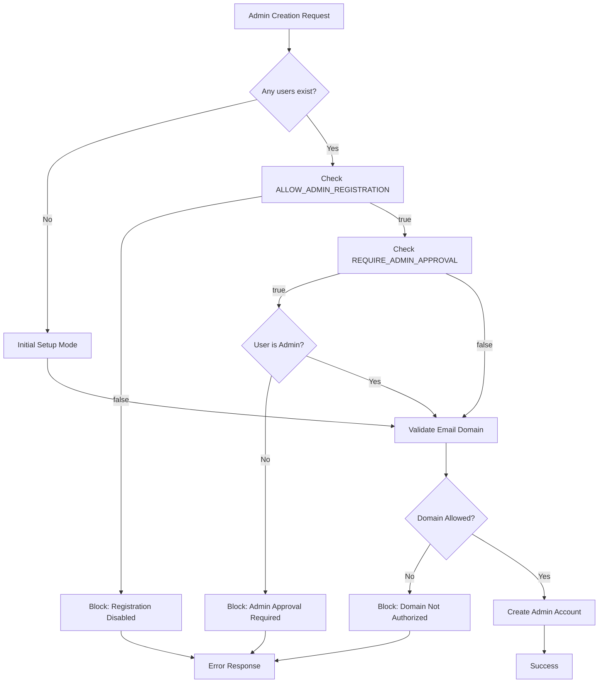

# 🔐 Admin Security Configuration Guide

## Overview

This system implements industry-standard security practices for admin account management, ensuring only authorized personnel can create and manage administrative accounts.

## Security Layers

### 1. 🌐 Email Domain Allowlist

**Purpose**: Restrict admin account creation to specific organizational email domains.

**Configuration**:
```bash
# Environment variable
ADMIN_EMAIL_DOMAINS=yourcompany.com,yourdomain.org,contractor.com

# Example: Only allow company emails
ADMIN_EMAIL_DOMAINS=bounce2bounce.com,b2b.company
```

**Behavior**:
- ✅ `admin@bounce2bounce.com` - Allowed
- ✅ `user@b2b.company` - Allowed  
- ❌ `hacker@gmail.com` - Blocked
- ❌ `admin@random.com` - Blocked

### 2. 🔒 Environment-Based Controls

**ALLOW_ADMIN_REGISTRATION** (default: `false`)
```bash
# Production (recommended)
ALLOW_ADMIN_REGISTRATION=false

# Development/Testing only
ALLOW_ADMIN_REGISTRATION=true
```

**REQUIRE_ADMIN_APPROVAL** (default: `true`)
```bash
# Require existing admin to create new admins
REQUIRE_ADMIN_APPROVAL=true

# Allow self-registration (NOT recommended)
REQUIRE_ADMIN_APPROVAL=false
```

### 3. 🛡️ Enhanced Password Requirements

Admin passwords must meet stricter criteria:
- **Minimum 12 characters** (vs 8 for regular users)
- **Uppercase letter** required
- **Lowercase letter** required
- **Number** required
- **Special character** required (`@$!%*?&`)

### 4. 🎯 Role-Based Access Control

**Initial Setup**:
- First admin can be created when no users exist
- Uses `/create-admin` endpoint
- No authentication required (one-time only)

**Subsequent Admins**:
- Must be created by existing admins
- Uses `/api/users/admin/create-admin` endpoint
- Requires admin authentication

## Implementation Details

### Authentication Flow



### Security Logging

All admin account operations are logged:
```
✅ Admin account created: admin@company.com (initial setup)
✅ Admin account created: user@company.com (by admin)
🚫 Admin registration disabled - hacker@gmail.com attempted to create admin account
🚫 Email domain gmail.com not in allowed list: company.com, partner.org
🚫 Non-admin user attempted to create admin account: user@company.com
```

## Production Deployment

### Recommended Configuration

```bash
# Disable public registration
DISALLOW_REGISTRATION=true

# Disable admin self-registration
ALLOW_ADMIN_REGISTRATION=false

# Require admin approval
REQUIRE_ADMIN_APPROVAL=true

# Restrict to company domains
ADMIN_EMAIL_DOMAINS=yourcompany.com,partner.org

# Enable email verification
MAIL_ENABLED=true
```

### Initial Setup Process

1. **Deploy application** with security settings
2. **Access `/create-admin`** (one-time only)
3. **Create first admin** with company email
4. **Subsequent admins** created via dashboard

### Emergency Access

If locked out of admin accounts:

1. **Database Access**: Manually update user role in database
2. **Environment Override**: Temporarily enable `ALLOW_ADMIN_REGISTRATION`
3. **Email Domain**: Add emergency domain to `ADMIN_EMAIL_DOMAINS`

⚠️ **Always revert emergency changes after resolving access issues**

## API Endpoints

### Public (Initial Setup Only)
- `POST /api/auth/create-admin` - First admin creation

### Admin-Only
- `POST /api/users/admin/create-admin` - Create additional admins
- `GET /api/users/admin` - List all users (admin view)
- `DELETE /api/users/admin/:id` - Delete user accounts

## Security Best Practices

### ✅ Do's
- Use company email domains only
- Require strong passwords for admins
- Enable email verification
- Monitor admin creation logs
- Regular security audits
- Backup admin account access

### ❌ Don'ts
- Allow public admin registration
- Use weak password requirements
- Skip email domain validation
- Ignore security logs
- Create admins with personal emails
- Disable authentication requirements

## Compliance

This implementation follows:
- **OWASP** authentication guidelines
- **SOC 2** access control requirements
- **ISO 27001** identity management standards
- **NIST** cybersecurity framework

## Troubleshooting

### Common Issues

**"Admin account creation is disabled"**
- Check `ALLOW_ADMIN_REGISTRATION` setting
- Verify user has admin role

**"Email domain not authorized"**
- Add domain to `ADMIN_EMAIL_DOMAINS`
- Check domain spelling/case

**"Only existing administrators can create new admin accounts"**
- Login with existing admin account
- Check `REQUIRE_ADMIN_APPROVAL` setting

### Support

For security-related issues:
1. Check application logs
2. Verify environment configuration
3. Contact system administrator
4. Review this documentation
